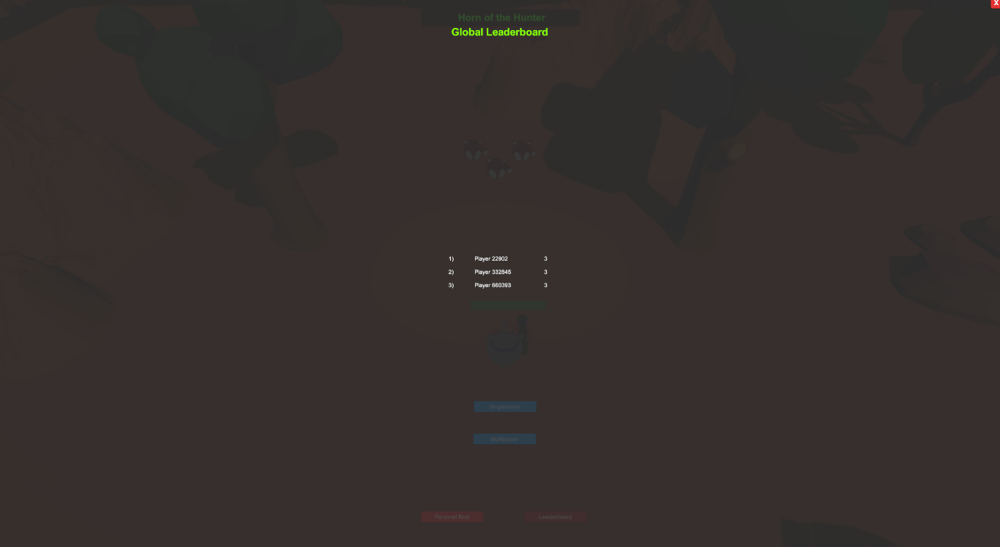
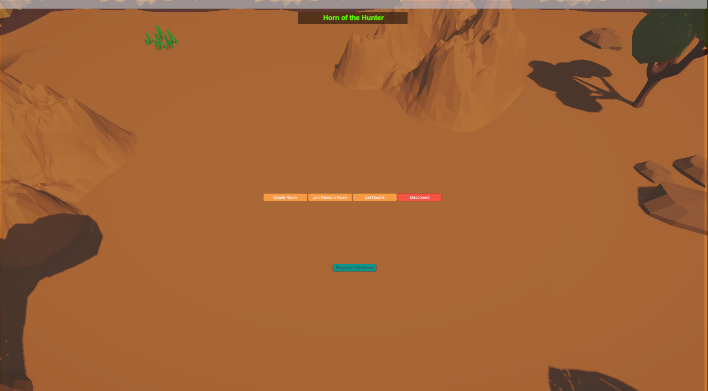
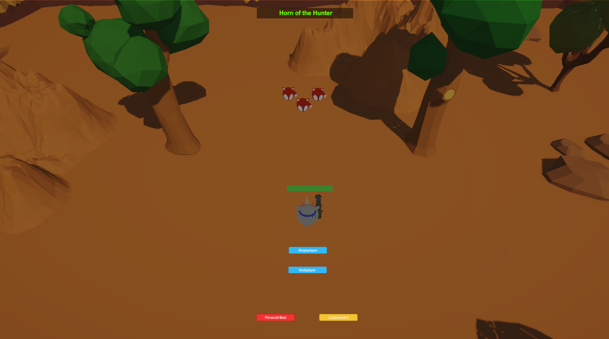
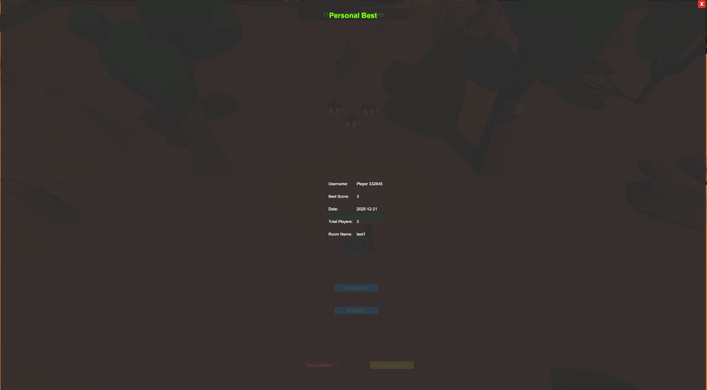
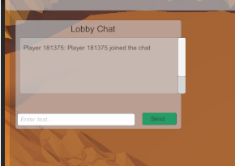
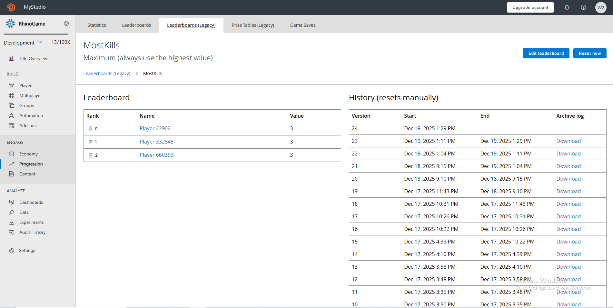

# 🦏 Rhino Shooter Bazooka — Multiplayer Beta

This repository contains my Unity multiplayer beta build, where I expanded the game by integrating Photon Networking for real-time multiplayer features and PlayFab for player accounts, persistence, and global leaderboards.

- **Photon PUN 2 multiplayer** (rooms, lobbies, syncing gameplay)
- **Photon Chat** (lobby + in-game chat)
- **PlayFab integration** (player login + display names + global leaderboards)
- **Persistent player data** (saved locally using JSON → Base64 → encryption)

The goal of this repo is to show the **networking + backend code and setup**, not a full Unity Assets export.

---

## Key Features

### Photon PUN 2 Multiplayer
- Connect / join lobby
- Create rooms + join random room
- Multiple clients tested (separate instances)
- State syncing + multiplayer flow

### Photon Chat
- Real-time chat in lobby (and usable during play)
- Toggle UI while playing so it doesn’t interrupt gameplay

### PlayFab (Persistence + Leaderboards)
- Login using **custom ID**
- Auto-assign **Display Name** on first login
- Global leaderboard(s) pulled dynamically
- Leaderboard UI generated at runtime from PlayFab data

### Local Saved Player Data
- Stores player stats like wins + custom metric
- Saved locally as:
  **JSON → Base64 → encrypted file**
- Prevents casual tampering (not plain text)

---

## Game Preview (Screenshots)

### Global Leaderboard UI

### Multiplayer Lobby

### Gameplay View

### Personal Best Popup

### Lobby Chat

### Azure PlayFab Results

## Repository Structure

/Scripts Core gameplay + networking + PlayFab + UI logic
/Prefabs Key prefabs used (player, UI panels, etc.)
/Scenes Unity scenes (menu, lobby, game scenes)
/ProjectSettings Unity configuration
/UserSettings Unity editor settings (local editor preferences)
/GamePreview
/README.md

---

## ▶️ How To Run

### 1) Unity Version
Open using the **same Unity version 6000.0.58f2**

### 2) Required Imports
This project expects you to have:
- **Photon PUN 2**
- **Photon Chat**
- **PlayFab SDK**

### 3) Setup IDs
- Set Photon App ID in: **PhotonServerSettings**
- Set PlayFab Title ID in the PlayFab editor settings

### 4) Run
- Start from the **Main Menu scene**
- Join multiplayer using 2 clients (or ParrelSync if used)

---

## Notes (Important)
- The leaderboard updates based on PlayFab data (MostKills / Wins etc.)
- Display name is only set if it’s missing, otherwise PlayFab keeps the old one
- Local save file is encrypted, so values aren’t stored in plain text

---

## 📜 License
MIT — free to reuse for learning/demo purposes.

